<!-- Rendered by scripts/render.py from profile.yaml. Edit those, not this file. -->

  <a href="https://piranha.studio"><picture><source media="(prefers-color-scheme: dark)" srcset="assets/hero.svg"></picture></a>

  <a href="https://piranha.studio"><picture><source media="(prefers-color-scheme: dark)" srcset="assets/link-site.svg"></picture></a>
  <a href="https://www.linkedin.com/in/satheesh1997/"><picture><source media="(prefers-color-scheme: dark)" srcset="assets/link-linkedin.svg"></picture></a>
  <a href="https://twitter.com/0xPiranhaCodes"><picture><source media="(prefers-color-scheme: dark)" srcset="assets/link-x.svg"></picture></a>
  <a href="https://esc-wq.medium.com/"><picture><source media="(prefers-color-scheme: dark)" srcset="assets/link-medium.svg"></picture></a>
  <a href="https://www.instagram.com/esc_wq/"><picture><source media="(prefers-color-scheme: dark)" srcset="assets/link-instagram.svg"></picture></a>

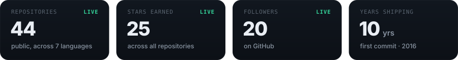

<picture><source media="(prefers-color-scheme: dark)" srcset="assets/section-activity.svg">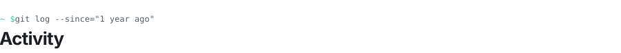</picture>

  
  

<a href="https://github.com/0xPiranhaCodes">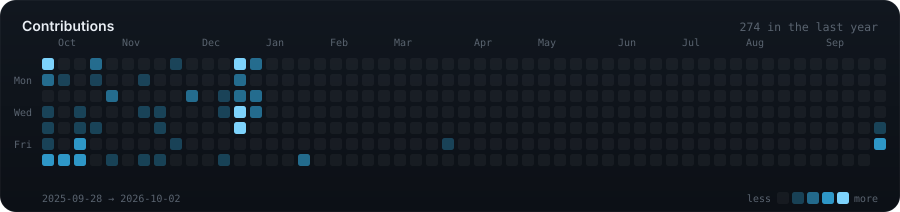</a>

<picture><source media="(prefers-color-scheme: dark)" srcset="assets/section-projects.svg"></picture>

  <a href="https://github.com/0xPiranhaCodes/webpty">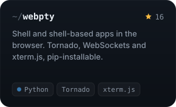</a>
  <a href="https://github.com/0xPiranhaCodes/iaBot">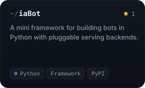</a>
  <a href="https://github.com/0xPiranhaCodes/hckre-cli-v1">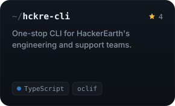</a>
  <a href="https://github.com/0xPiranhaCodes/boom">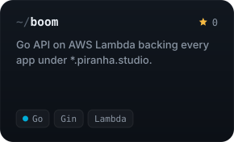</a>
  <a href="https://github.com/0xPiranhaCodes/django-boilerplate">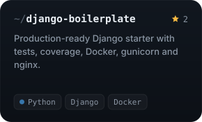</a>
  <a href="https://github.com/0xPiranhaCodes/sache">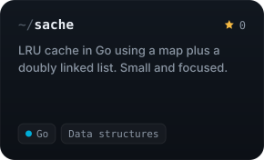</a>

<b>More things I've built</b>

 

| Project | What it is | Stack |
|---|---|---|
| [node-codecompiler-ide](https://github.com/0xPiranhaCodes/node-codecompiler-ide) | Web IDE that compiles code and checks it against test cases | `Node.js · Express · MongoDB` |
| [rest-microservice](https://github.com/0xPiranhaCodes/rest-microservice) | Flask microservice boilerplate with Docker Compose and MySQL | `Python · Flask · Docker` |
| [django-3.x-api-boilerplate](https://github.com/0xPiranhaCodes/django-3.x-api-boilerplate) | DRF API starter with pipenv and pre-commit hooks | `Django REST Framework` |
| [django-ease](https://github.com/0xPiranhaCodes/django-ease) | Abstract models, utils and decorators reused across Django apps | `Python · Django` |
| [python3-boilerplate](https://github.com/0xPiranhaCodes/python3-boilerplate) | Minimal Python 3 project template with pytest | `Python` |
| [express-auth-service](https://github.com/0xPiranhaCodes/express-auth-service) | Drop-in auth service | `Node.js · MongoDB` |
| [blogify-api](https://github.com/0xPiranhaCodes/blogify-api) | Blog backend API | `Ruby on Rails` |
| [rails-jwt](https://github.com/0xPiranhaCodes/rails-jwt) | JWT auth API | `Ruby on Rails` |
| [go-notifier](https://github.com/0xPiranhaCodes/go-notifier) | Desktop notifications package | `Go` |
| [go-weather](https://github.com/0xPiranhaCodes/go-weather) | Weather CLI | `Go` |
| [simple-cdn](https://github.com/0xPiranhaCodes/simple-cdn) | Static file serving for dev | `Docker` |
| [assets](https://github.com/0xPiranhaCodes/assets) | Static assets for *.piranha.studio | `GitHub Pages` |
| [tut-django-like-shell-plus](https://github.com/0xPiranhaCodes/tut-django-like-shell-plus) | Companion code for a Medium article | `Python` |
| [tut-react-dark-mode](https://github.com/0xPiranhaCodes/tut-react-dark-mode) | Companion code for a Medium article | `React` |

<picture><source media="(prefers-color-scheme: dark)" srcset="assets/section-stack.svg"></picture>

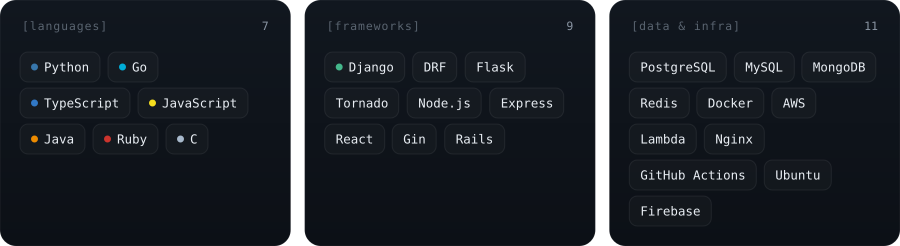

 

<picture><source media="(prefers-color-scheme: dark)" srcset="assets/statusbar.svg"></picture>
